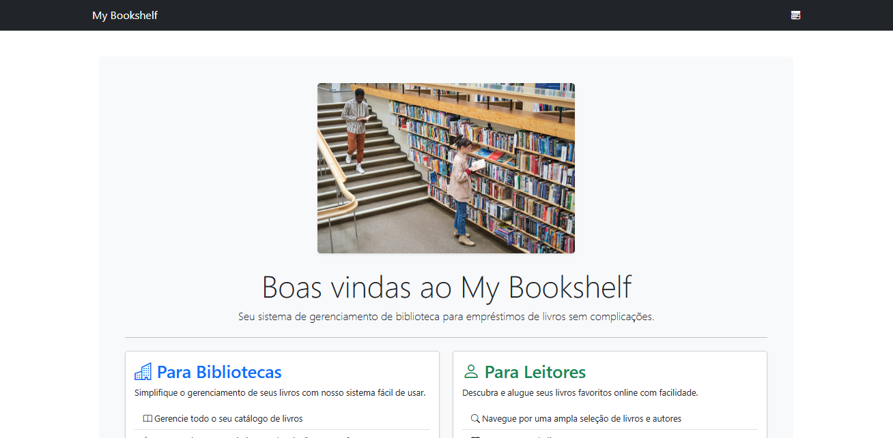
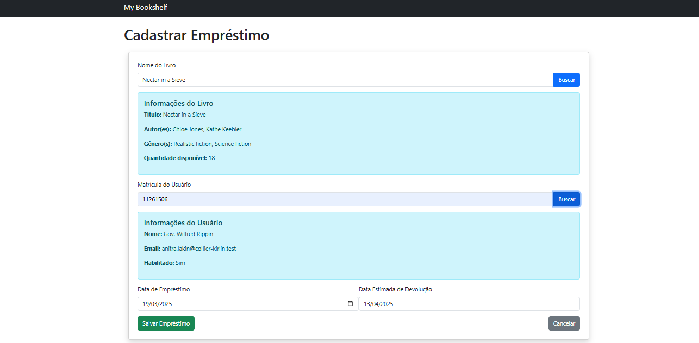
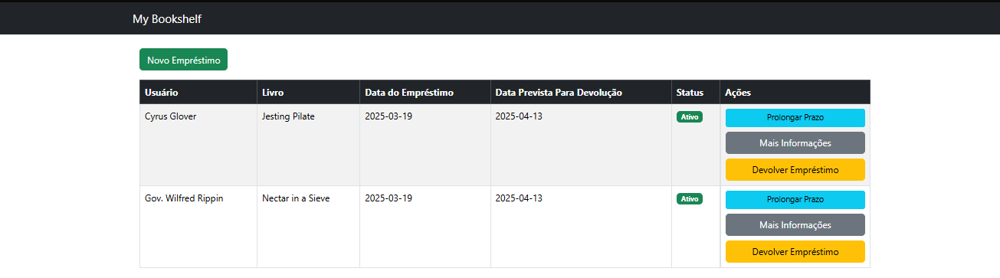

# My Bookshelf

My Bookshelf é um sistema de gerenciamento de Bibliotecas Acadêmicas. Ele permite que os gerentes da biblioteca cadastrem livros, gerenciem os empréstimos e devolução de maneira prática e eficiente.

## 📌 Funcionalidades
- Gerenciamento de livros 📖
- Registro de usuários 👤
- Controle de empréstimos e devoluções 🔄
- Notificações de prazos 📅
- Relatórios sobre status de empréstimos 📊

## 📊 Demonstrações
<figure>
  
  <figcaption align="center">Tela Principal</figcaption>
</figure>
<div style="display: flex; justify-content: center; heigth:200px width:100% gap: 10px;">
<figure>
  
  <figcaption align="center">Cadastrando um Empréstimo</figcaption>
</figure>

</div>
<!-- <figure>
  
  <figcaption align="center">Listando Empréstimos</figcaption>
</figure> -->

## 🛠️ Tecnologias Utilizadas
- [**Ruby on Rails**](https://rubyonrails.org) - Framework principal
- [**SQLite**](https://www.powersync.com/sqlite-resources) - Banco de dados
-[**Bootstrap**](https://getbootstrap.com) - Estilização da interface

## 🚀 Instalação
1. Clone este repositório:
   ```sh
   git clone https://github.com/seu-usuario/my-bookshelf.git
   cd my-bookshelf
   ```
2. Instale as dependências:
   ```sh
   bundle install
   ```
3. Configure o banco de dados:
   ```sh
   rails db:create db:migrate db:seed
   ```
4. Inicie o servidor:
   ```sh
   rails server
   ```
5. Acesse no navegador:
   ```
   http://localhost:3000
   ```

## 📜 Licença
Este projeto é open-source sob a licença MIT.

---
📬 Se precisar de ajuda, sinta-se à vontade para abrir uma issue ou contribuir com melhorias! 🚀
